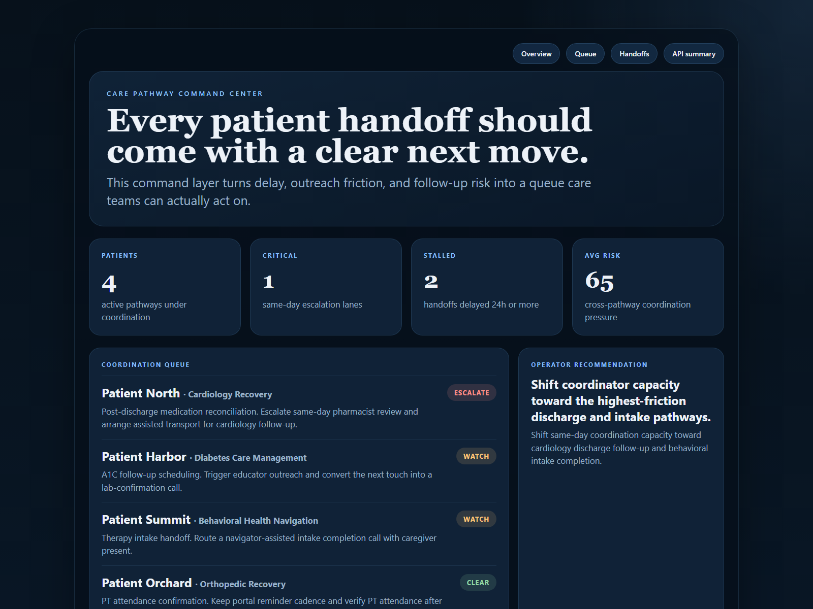
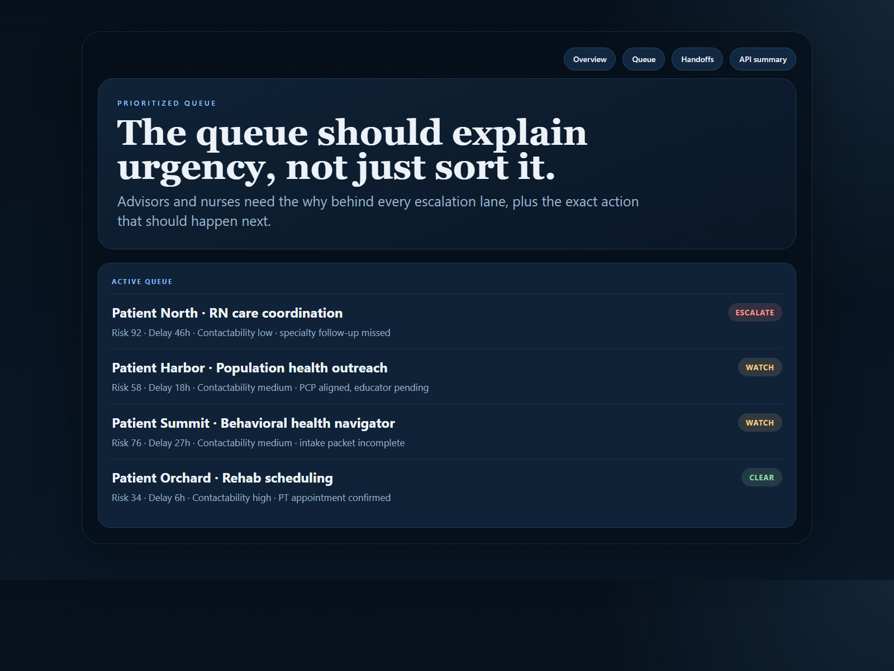
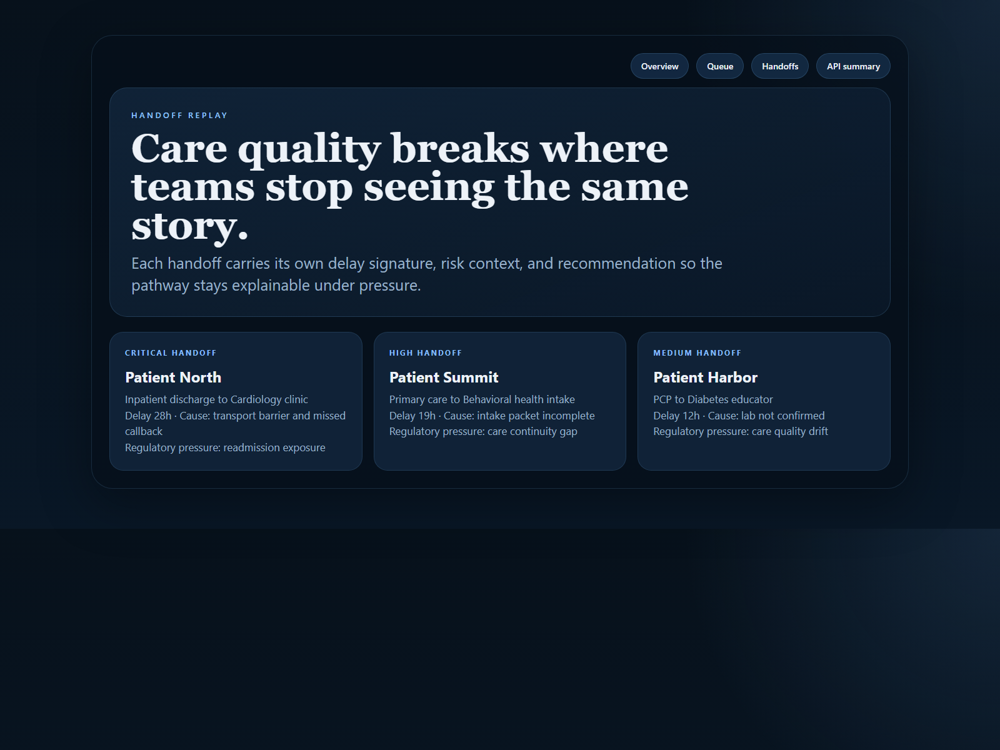
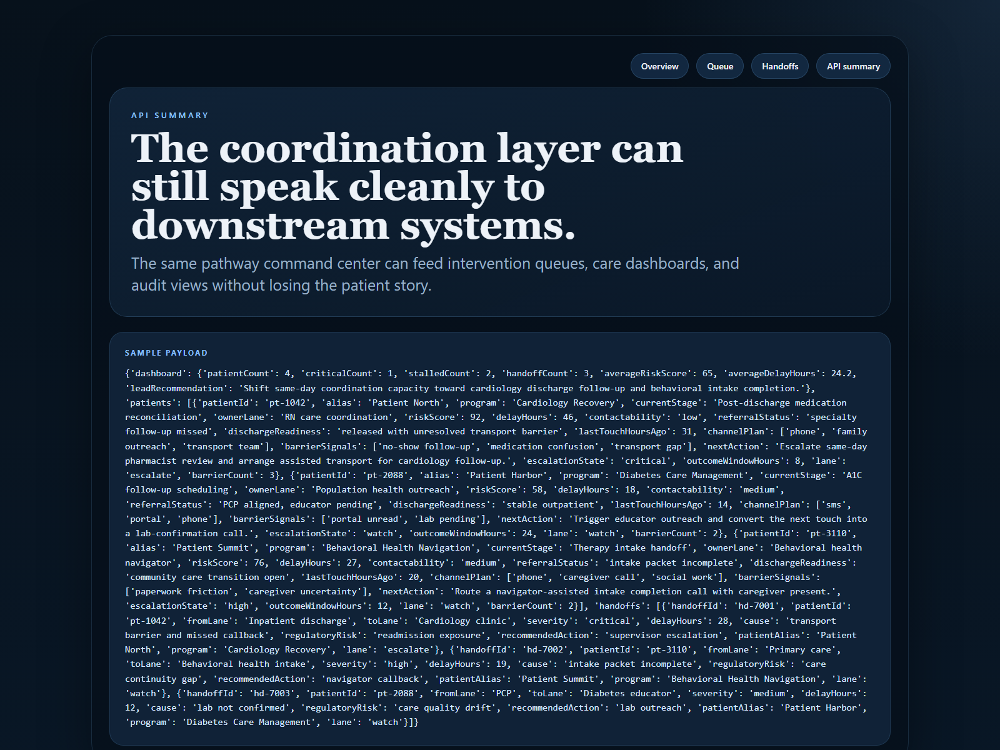

# Care Pathway Command Center

Operational command center for care-pathway coordination, handoff risk, and follow-up escalation across patient journeys.

## Why it matters

Care operations rarely fail because teams lack data. They fail because handoffs drift, queues hide urgency, and no one owns the next action clearly enough. This repo models a care coordination layer that keeps discharge, referral, follow-up, and outreach work visible under pressure.

## What it does

- Scores active patient pathways by risk, delay pressure, and follow-up friction
- Prioritizes a coordination queue for nurses, navigators, and outreach teams
- Tracks cross-team handoffs with cause, severity, and recommended response
- Publishes human-readable proof surfaces and API-friendly outputs from the same service layer

## Proof









## Local run

```powershell
cd care-pathway-command-center
py -3.11 -m venv .venv
.\.venv\Scripts\pip.exe install -r requirements.txt
.\.venv\Scripts\python.exe -m app.main
```

Open:

- `http://127.0.0.1:4887/`
- `http://127.0.0.1:4887/queue`
- `http://127.0.0.1:4887/handoffs`
- `http://127.0.0.1:4887/docs`

## Validation

```powershell
.\.venv\Scripts\python.exe -m unittest discover -s tests
.\.venv\Scripts\python.exe scripts\run_demo.py
.\.venv\Scripts\python.exe scripts\smoke_check.py
.\.venv\Scripts\python.exe scripts\render_readme_assets.py
```

## Repo layout

- `app/main.py` FastAPI routes and local runtime entrypoint
- `app/services/care_pathway_service.py` coordination scoring and sample payload logic
- `app/data/sample_pathways.json` sample pathway, handoff, and intervention data
- `app/render.py` README proof surface generation
- `docs/architecture.md` system framing and data flow
